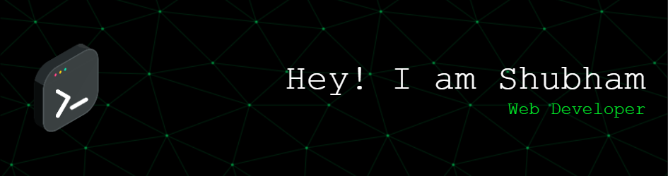

<!--h1 align="center">Hi 👋, I'm Shubham Kumar Patel</h1-->
<!--h3 align="center">A passionate web developer from India.</h3-->

- 🔭 I’m currently working on **Flutter project.**

- 🌱 I’m currently learning **Dart, Kotlin.**

- 💬 Ask me about **Django, React.**

- 📫 How to reach me **raj2013atel@gmail.com**

- 📄 Know about my experiences [drive link](https://drive.google.com/file/d/1ttL3BU0-Ue4RYOOLHnKJnJ2EHzgM4Xsa/view?usp=sharing) 

 

<h3 align="left">About me:</h3>

- ♟️ Chess Lover: Looking for a game? Challenge me to a match anytime!

- 🧩 Puzzle Enthusiast: I'm not just about code! Catch me solving a Rubik's Cube in under 4 minutes—always striving to beat my best time.

- 💡 Continuous Improvement: Just like optimizing code, I'm constantly honing my Rubik's Cube skills, aiming to shave off seconds from my solving time. There's always room for improvement!

- 🚀 Tech Enthusiast: When I'm not unraveling puzzles or making strategic moves on the chessboard, you'll find me exploring the latest in tech and writing clean, efficient code.

Let's connect and share our passion for coding, puzzles, or a great game of chess! 🚀✨

 

<h3 align="left">Connect with me:</h3>

 

<h3 align="left">Languages and Tools:</h3>

                  

  
  

